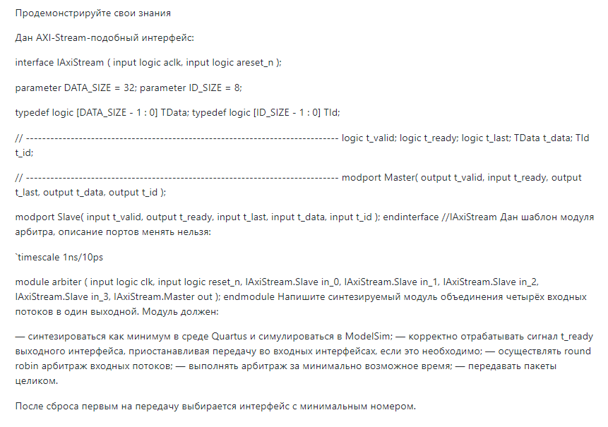

# axi_arbiter
test task from company

## Задание

## Решение
Табуляция исходников в проекте = 2;

Вопросы:
1) Не ясна логика сигнала TId t_id для текущего задания. Реализовал не учитывал при разработке rtl и testbench.  
2) Присутствуют инкапсулированные параметры, которые не возможно использовать вне интерфейса IAxiStream.
	parameter DATA_SIZE = 32;
	parameter ID_SIZE = 8;
	typedef logic [DATA_SIZE - 1 : 0] TData;
	typedef logic [ID_SIZE - 1 : 0] TId;
	Реализовал дублирование кода.
3) В задании нет требования по частоте. Реализовал без учета требования к частоте.
4) Не описано поведение в следующей ситуации: входной интерфейс axi_master завис при передаче. 
	 Реализовал так: модуль arbiter зависнет, если выбранный axi_master зависнет при передаче пакета 

Версия quartus 18.1 

Cтруктура проекта: 
src\ 					- исходники rtl
sim\					- исходники testbench
arbiter.qpf   - настройки проекта quartus
arbiter.qsf		- настройки quartus
fpga.sdc			- файл с временными ограничениями
схема_testbench.png - структурная схема testbench

RTL:
	Реализовал параметризованный модуль axi_arbiter.sv c задержкой 1 такт, латентностью 0 тактов. Реализованный алгоритм round_robin реализован как
	приоритетный мультиплексор. Данная реализация имеет маленькую задержку, но имеет ограничение по частоте ( из-за большого количества уровней логики ).
  Есть возможность реализовать axi_arbiter с задержкой 0 тактов, но без параметризации, с низкой частотой и ужасной читаемостью кода.

Testbench:
	Запуск testbench:
		1) запускаем modelsim
		2) переходим в каталог c исходниками для симуляции:
			2.1) в консоли modelsim переходим в каталог sim\ либо через gui: file->Change Directory
		3) в консоли modelsim выполняем скрипт : do make.tcl
		4) в консоли modelsim запускаем сценарий симуляции : run_test 
		5) Тест завершается примерно через 1 микросекунду, со следующим выводом на консоль modelsim:
			# *************************************************
			# ********            TEST PASSED         *********
			# *************************************************
			# 
			# **************************************
			#  891275 : TestCase 4 : end()	
		
		
	1) В написании testbench присутствовали следующие ограничения:
		SystemVerilog Program Blocks are not supported in Modelsim PE.
		The ModelSim-Altera Edition software does not support randomization, coverage, or assertions.	
	2) Структурная схема исходников представлена схема_testbench.png 
	3) TestCases описаны в модуле tb_top.sv
	
	
TODO: 
1) Входной интерфейс имеет инкапсулированные параметры. В src и sim коде есть дублирование кода 
2) проверить модуль axi_arbiter при различных параметрах NUM_CHANNELS
3) 
